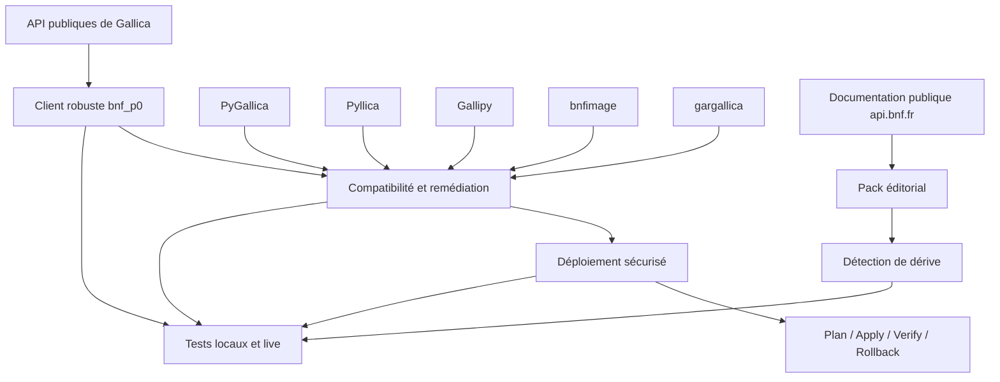

# Maintenance des scripts et wrappers Gallica référencés par api.bnf.fr

Ce dépôt regroupe le travail d’**audit, de correction, de compatibilité, de validation et de documentation** réalisé autour des scripts et wrappers tiers historiquement référencés sur [api.bnf.fr](https://api.bnf.fr/) pour interroger ou télécharger des ressources de Gallica.

Il répond à un problème simple : plusieurs exemples et bibliothèques liés à Gallica ont été publiés ou référencés au fil des années, mais les API, les pratiques HTTP, les quotas, les dépendances Python/R et les projets tiers ont évolué. Certains wrappers sont désormais anciens ou archivés ; d’autres fonctionnent encore mais présentent des problèmes de compatibilité, de robustesse ou de documentation.

Le rôle de ce dépôt est donc de fournir une **couche de maintenance vérifiable** autour de cet écosystème.

Il contient notamment :

- un client Python commun et robuste pour les principaux services publics de Gallica ;
- des correctifs de compatibilité pour plusieurs wrappers Python historiques ;
- des correctifs pour des clients R ;
- un mécanisme sécurisé permettant d’appliquer ces correctifs à un checkout des projets concernés ;
- une vérification automatique de la dérive des fichiers tiers audités ;
- des tests contre les API publiques de Gallica ;
- un ensemble de propositions de mise à jour pour la documentation publique d’api.bnf.fr ;
- une surveillance automatique de la dérive de cette documentation.

> **Important**
>
> Ce dépôt n’est ni un nouveau wrapper officiel Gallica, ni un fork général de tous les projets concernés.
>
> Il constitue un **dépôt de maintenance et de remédiation** : il conserve les interfaces historiques lorsque cela est utile, corrige les problèmes identifiés et fournit les outils nécessaires pour vérifier que ces corrections restent applicables.

---

## Pourquoi ce dépôt existe

La documentation d’api.bnf.fr référence historiquement plusieurs projets permettant d’utiliser Gallica depuis Python ou R.

Parmi eux :

- PyGallica ;
- Pyllica ;
- Gallipy ;
- bnfimage ;
- gargallica ;
- certaines ressources historiques comme fdh-gallica.

Ces projets sont **des projets tiers**. Leur présence dans la documentation d’api.bnf.fr ne signifie pas nécessairement qu’ils sont développés, maintenus ou supportés par la BnF.

Un audit réalisé en 2026 a identifié **24 problèmes ou points de vigilance** concernant cet ensemble : bugs d’exécution, appels HTTP anciens, mauvaise gestion des erreurs, téléchargements redondants, absence de limitation des requêtes coûteuses, dépendances obsolètes, ambiguïtés documentaires, mélange de versions IIIF, etc.

Les problèmes identifiés n’étaient pas tous de même nature.

Certains pouvaient être corrigés directement par du code :

- appels HTTP → HTTPS ;
- erreurs Python ;
- compatibilité avec les réponses actuelles de Gallica ;
- gestion de HTTP 429 ;
- retries ;
- timeouts ;
- rate limiting ;
- téléchargement PDF ;
- traitement des années bissextiles ;
- appels IIIF ;
- parsing XML.

D’autres relèvent de la publication ou de la gouvernance :

- actualiser une page d’api.bnf.fr ;
- signaler qu’un wrapper est historique ou archivé ;
- corriger la documentation d’un dépôt tiers ;
- supprimer ou remplacer un lien historique devenu non vérifiable.

Le dépôt sépare volontairement ces deux catégories.

---

# Vue d’ensemble

Le projet peut être compris comme trois couches principales :



### 1. Couche technique

`src/bnf_p0/` contient un client commun permettant d’accéder de manière plus robuste aux services Gallica.

### 2. Couche de compatibilité

`legacy_replacements/` et `src/bnf_p0/compat/` contiennent les remplacements ou adaptateurs nécessaires pour conserver autant que possible les interfaces des anciens wrappers.

### 3. Couche de validation et de documentation

Les dossiers `scripts/`, `tests/`, `validation/` et `docs/api.bnf.fr/` permettent de vérifier les corrections et de préparer la mise à jour de la documentation publique.

---

# Structure du dépôt

```text
.
├── src/
│   └── bnf_p0/
│       ├── client.py
│       ├── http.py
│       ├── rate_limit.py
│       ├── ark.py
│       ├── xmlutil.py
│       ├── pdf_tools.py
│       ├── deploy.py
│       └── compat/
│           ├── pygallica.py
│           └── pyllica.py
│
├── legacy_replacements/
│   ├── PyGallica/
│   ├── Pyllica/
│   ├── Gallipy/
│   ├── bnfimage/
│   └── gargallica/
│
├── deployment/
│   └── upstream_manifest.json
│
├── scripts/
│   ├── deploy_legacy.py
│   ├── live_validate.py
│   ├── network_diagnose.py
│   ├── upstream_validate.py
│   └── verify_public_documentation_contract.py
│
├── docs/
│   ├── AUDIT_CLOSURE.md
│   └── api.bnf.fr/
│       ├── README.md
│       ├── wrappers-gallica.md
│       ├── pyllica.md
│       ├── iiif-gallica.md
│       ├── wrapper-status.json
│       └── sources.md
│
├── tests/
├── validation/
└── .github/workflows/
```

---

# Le client Gallica commun

Le package `bnf_p0` fournit un `GallicaClient` qui centralise les appels effectués par les correctifs.

L’objectif n’est pas de créer une nouvelle abstraction complète de Gallica, mais d’éviter que chaque ancien script réimplémente séparément :

- les URLs ;
- le parsing ;
- les timeouts ;
- les retries ;
- la gestion de HTTP 429 ;
- les limitations de cadence ;
- la normalisation des ARK.

## Services actuellement couverts

`GallicaClient` expose notamment :

| Méthode | Service / fonction |
|---|---|
| `sru()` | recherche SRU |
| `oai_record()` | service OAIRecord |
| `pagination()` | service Pagination |
| `view_count()` | nombre de vues d’un document |
| `issues()` | service Issues |
| `issue_for_date()` | résolution d’un numéro de périodique à partir d’une date |
| `content_search()` | recherche dans le contenu |
| `toc()` | table des matières |
| `texte_brut()` | récupération du texte OCR |
| `alto()` | récupération de l’ALTO |
| `precalculated_image()` | images précalculées Gallica |
| `iiif_info()` | `info.json` IIIF |
| `iiif_image()` | récupération d’une image IIIF |
| `pdf()` | téléchargement PDF |

---

## Installation et exemple minimal

```bash
git clone https://github.com/maribakulj/maj-scripts-api.bnf.fr.git
cd maj-scripts-api.bnf.fr

python -m venv .venv
source .venv/bin/activate

python -m pip install --upgrade pip
python -m pip install -e .
```

Sous Windows :

```powershell
.venv\Scripts\activate
```

Puis :

```python
from bnf_p0 import GallicaClient

with GallicaClient() as gallica:
    result = gallica.sru(
        'gallica all "Victor Hugo"',
        maximum_records=10,
    )

print(result)
```

Autre exemple, pour récupérer un fichier ALTO :

```python
from bnf_p0 import GallicaClient

with GallicaClient() as gallica:
    alto = gallica.alto("bpt6k5619759j", 3)

GallicaClient.save(alto, "page-3.xml")
```

---

# Robustesse HTTP

Les appels réseau passent par `RobustHttpClient`.

Il apporte notamment :

- un timeout ;
- le suivi des redirections ;
- plusieurs tentatives en cas d’échec ;
- un backoff progressif ;
- la gestion de l’en-tête `Retry-After` ;
- la reprise sur certaines erreurs serveur ;
- une gestion spécifique de HTTP `429 Too Many Requests`.

Les codes actuellement considérés comme réessayables sont :

```text
429
500
502
503
504
```

Les erreurs HTTP non prévues ne sont pas silencieusement transformées en réponses valides : elles sont remontées au code appelant.

---

# Limitation des requêtes

Certaines opérations Gallica sont plus coûteuses que d’autres.

Le client utilise donc plusieurs catégories de requêtes auxquelles sont associées des cadences différentes.

Les valeurs actuellement configurées dans le client Python sont :

| Catégorie | Intervalle minimal |
|---|---:|
| IIIF haute définition | 12,25 s |
| texte brut | 12,25 s |
| PDF | 15,25 s |
| image `highres` précalculée | 1,25 s |
| requête standard | pas d’attente spécifique |

Ces valeurs sont des paramètres de prudence du client et ne doivent pas être interprétées comme une définition permanente du contrat public de Gallica.

Les quotas documentés publiquement restent la référence. Une surveillance automatique du dépôt vérifie justement si cette documentation évolue.

---

# Compatibilité avec les wrappers historiques

Le projet cherche autant que possible à corriger les problèmes sans imposer une réécriture complète des scripts existants.

## PyGallica

PyGallica est traité comme une ressource historique.

Le dépôt fournit une couche de compatibilité reproduisant notamment les interfaces :

```python
Search
Document
IIIF
```

Elle corrige plusieurs problèmes de l’implémentation historique, notamment :

- les recherches utilisant un fichier temporaire ;
- le parsing de certaines réponses XML ;
- la différence `Document.oai` / `Document.OAI` ;
- les appels IIIF ;
- la robustesse HTTP.

Le cœur `bnf_p0` est installé avec les remplacements afin d’éviter de réimplémenter ces mécanismes dans chaque fichier historique.

---

## Pyllica

Les remplacements Pyllica conservent autant que possible le fonctionnement des scripts historiques tout en corrigeant notamment :

- les téléchargements inutiles ou redondants ;
- la manipulation des dates ;
- les années bissextiles ;
- les téléchargements PDF ;
- les images de grande taille ;
- la prise en compte des limitations de requêtes Gallica.

---

## Gallipy

Gallipy n’est pas réécrit intégralement.

Le projet applique au contraire des corrections ciblées afin de limiter le risque de régression.

Elles couvrent notamment :

- deux erreurs liées à la variable utilisée dans les fonctions IIIF asynchrones ;
- l’adaptation au schéma actuellement renvoyé par Gallica ;
- la reconstruction de PDF ;
- la migration depuis des usages anciens de PyPDF2 vers `pypdf` ;
- une politique de retry bornée.

---

## bnfimage

`bnfimage` est un client R.

Le remplacement proposé :

- conserve l’interface historique de `bi_image()` ;
- distingue les requêtes IIIF ordinaires des requêtes haute définition ;
- applique une cadence prudente aux requêtes HD ;
- respecte `Retry-After` en cas de HTTP 429 ;
- dispose d’un backoff de secours ;
- utilise un timeout ;
- remonte correctement les erreurs HTTP.

---

## gargallica

Pour `gargallica`, le dépôt :

- migre les appels SRU de HTTP vers HTTPS ;
- introduit un helper réseau commun ;
- limite les appels `.texteBrut` ;
- gère les erreurs temporaires et HTTP 429 ;
- respecte `Retry-After` lorsque le serveur le fournit ;
- conserve autant que possible le script d’analyse historique.

---

## fdh-gallica

`fdh-gallica` constitue un cas différent.

Aucun profil de déploiement automatique n’est fourni tant que la ressource historique et son emplacement ne peuvent pas être vérifiés de manière satisfaisante.

Le problème est donc traité au niveau **éditorial**, pas en prétendant maintenir artificiellement un projet dont l’état n’est pas établi.

---

# Déployer les correctifs dans un wrapper historique

Le dépôt contient un outil dédié :

```text
scripts/deploy_legacy.py
```

Son rôle est d’appliquer les remplacements sans modifier aveuglément un checkout tiers.

Profils disponibles :

```text
pygallica
pyllica
gallipy
gargallica
bnfimage
```

## Principe de sécurité

Le fichier :

```text
deployment/upstream_manifest.json
```

décrit pour chaque profil :

- le dépôt tiers concerné ;
- sa branche historique de référence ;
- les fichiers concernés ;
- le Git blob SHA de la version auditée ;
- le type d’opération à réaliser ;
- le fichier de remplacement éventuel.

Avant toute modification, le déployeur compare donc le fichier présent sur disque avec la version effectivement auditée.

Il ne part pas du principe particulièrement optimiste que le code tiers n’a jamais changé.

---

## 1. Toujours commencer par `plan`

Exemple avec PyGallica :

```bash
python scripts/deploy_legacy.py plan \
    --profile pygallica \
    --target /chemin/vers/PyGallica
```

Le plan peut notamment signaler :

| État | Signification |
|---|---|
| `EXPECTED` | le fichier correspond à la version amont auditée |
| `EXPECTED_ABSENT` | le fichier doit être créé et n’existe pas encore |
| `ALREADY_APPLIED` | le correctif est déjà présent |
| `MISSING` | un fichier attendu n’existe pas |
| `DRIFT` | le fichier a changé depuis l’audit |

`MISSING` et `DRIFT` bloquent normalement le déploiement.

---

## 2. Appliquer

Une fois le plan vérifié :

```bash
python scripts/deploy_legacy.py apply \
    --profile pygallica \
    --target /chemin/vers/PyGallica
```

Le déployeur :

1. crée une sauvegarde ;
2. applique les remplacements ou patches ;
3. copie le cœur `bnf_p0` lorsqu’il est nécessaire au wrapper ;
4. enregistre les modifications réalisées.

Les informations permettant de revenir en arrière sont stockées dans :

```text
.bnf-p0-state.json
```

Les sauvegardes sont conservées sous :

```text
.bnf-p0-backup/
```

---

## 3. Vérifier

```bash
python scripts/deploy_legacy.py verify \
    --profile pygallica \
    --target /chemin/vers/PyGallica
```

La commande contrôle que tous les fichiers attendus sont effectivement dans l’état corrigé.

---

## 4. Revenir en arrière

```bash
python scripts/deploy_legacy.py rollback \
    --target /chemin/vers/PyGallica
```

Le rollback :

- restaure les fichiers qui existaient avant le déploiement ;
- supprime les fichiers qui avaient été créés par le déployeur ;
- restaure également les dossiers gérés lorsque nécessaire.

---

## Utilisation de `--force`

Le déployeur refuse normalement de remplacer un fichier lorsque son contenu ne correspond plus à la version auditée.

Il est possible de contourner ce contrôle avec :

```text
--force
```

mais uniquement après examen manuel des différences.

`--force` ne signifie pas « cette modification est probablement sans danger ».

Il signifie seulement : « la dérive a été constatée et l’opérateur accepte explicitement d’appliquer le correctif malgré cette dérive ».

---

# Tester le projet

Pour installer les dépendances de développement :

```bash
python -m pip install -e . pytest
```

Puis :

```bash
pytest -q
```

La suite de tests couvre notamment :

- la normalisation des identifiants ARK ;
- le client Gallica ;
- la gestion HTTP ;
- le rate limiting ;
- les dates ;
- les fichiers PDF ;
- les couches de compatibilité ;
- les remplacements historiques ;
- le déployeur ;
- le manifeste ;
- les remplacements R ;
- le pack documentaire.

---

# Validation contre Gallica

Les tests unitaires ne suffisent pas à vérifier qu’un service externe existe toujours et se comporte comme prévu.

Le dépôt possède donc également des smoke tests contre les services publics de Gallica.

## Diagnostic réseau

```bash
python scripts/network_diagnose.py
```

Cette étape permet de distinguer :

- un véritable échec fonctionnel ;
- une impossibilité d’accéder à Gallica depuis l’environnement de test.

## Validation live

```bash
python scripts/live_validate.py
```

Le script vérifie actuellement plusieurs opérations réelles, dont :

- `Pagination` ;
- `OAIRecord` ;
- `Issues` ;
- `SRU` ;
- `ALTO` ;
- `IIIF info.json`.

Le résultat est également sérialisé sous forme de rapport JSON.

---

# Surveillance des dépôts tiers

Une correction locale n’est sûre que tant que le fichier tiers auquel elle s’applique reste celui qui a réellement été audité.

Le script :

```bash
python scripts/upstream_validate.py
```

interroge donc GitHub et compare les Git blob SHA actuels des fichiers tiers avec ceux enregistrés dans :

```text
deployment/upstream_manifest.json
```

Deux situations particulières sont détectées :

### `DRIFT`

Un fichier existant n’est plus identique à celui audité.

Le correctif doit alors être réexaminé avant de mettre à jour son SHA dans le manifeste.

### `COLLISION`

Un fichier que le déployeur devait créer existe désormais en amont.

Cela peut signifier que le projet tiers a évolué ou qu’un correctif comparable a été intégré.

Dans les deux cas, le dépôt doit être réévalué plutôt que de continuer silencieusement avec les anciennes hypothèses.

---

# Documentation api.bnf.fr

Une partie des problèmes identifiés ne se trouve pas dans les wrappers eux-mêmes, mais dans la manière dont ils sont présentés publiquement.

Le dossier :

```text
docs/api.bnf.fr/
```

constitue un **pack éditorial prêt à relire et à publier**.

Il comprend :

### `wrappers-gallica.md`

Proposition de remplacement de la page consacrée aux wrappers Gallica.

Elle cherche notamment à distinguer clairement :

- API BnF ;
- projet tiers ;
- projet historique ;
- projet audité ;
- projet non vérifiable.

### `pyllica.md`

Proposition de documentation actualisée pour Pyllica, notamment concernant les API utilisées et les limitations d’usage.

### `iiif-gallica.md`

Proposition de clarification de la documentation IIIF.

Elle distingue notamment :

- IIIF Image API ;
- IIIF Presentation API ;
- versions réellement documentées/publiquement exposées ;
- éventuels chantiers de migration distincts.

### `wrapper-status.json`

Matrice exploitable par machine décrivant le statut documentaire des différents wrappers.

### `sources.md`

Sources publiques utilisées pour vérifier les informations du pack éditorial.

---

# Détection de dérive de la documentation publique

Le dépôt ne suppose pas que la documentation d’api.bnf.fr restera éternellement identique.

Le script :

```bash
python scripts/verify_public_documentation_contract.py
```

consulte plusieurs pages publiques d’api.bnf.fr et vérifie les hypothèses sur lesquelles repose le pack éditorial.

Il surveille notamment :

- la présence des indications de quota ;
- les informations relatives à HTTP 429 ;
- la version IIIF annoncée publiquement ;
- la liste des wrappers encore présents ;
- certains exemples de téléchargement haute définition.

Si le site public change, le workflow signale une **dérive** afin que la documentation proposée dans ce dépôt soit réévaluée.

L’objectif est d’éviter qu’une documentation initialement correcte devienne progressivement fausse sans que personne ne le remarque.

---

# Intégration continue

Le projet utilise plusieurs workflows GitHub Actions indépendants.

## 1. Régressions Python

`P0 local regression suite`

Exécute la suite de tests sous :

- Python 3.10 ;
- Python 3.12.

## 2. Validation publique Gallica

`P0 public Gallica validation`

Teste les API publiques de Gallica depuis un runner GitHub, donc indépendamment du réseau interne BnF.

Il est également exécuté automatiquement chaque lundi.

## 3. Validation du déploiement legacy

`P0 legacy deployment validation`

Teste :

```text
apply → verify → rollback
```

et vérifie également les Git blob SHA des fichiers tiers audités.

Cette vérification est elle aussi planifiée chaque semaine.

## 4. Compatibilité R

`P1 R compatibility validation`

Vérifie notamment :

- que les fichiers R corrigés peuvent être parsés ;
- la classification des requêtes IIIF haute définition utilisée par `bnfimage`.

## 5. Documentation

`P2 documentation validation`

Vérifie :

- le pack éditorial ;
- certains invariants documentaires ;
- la cohérence avec les pages publiques actuelles d’api.bnf.fr.

La détection de dérive documentaire est également exécutée chaque lundi.

---

# Rapports de validation

Les résultats produits par les scripts automatisés sont conservés sous :

```text
validation/
```

Ils permettent de conserver une trace machine-readable des vérifications effectuées.

Les workflows GitHub Actions publient également certains rapports comme artifacts afin qu’ils puissent être examinés après l’exécution.

---

# Statut des différents projets audités

Le dépôt ne déduit volontairement **pas** le statut de maintenance d’un projet simplement parce que son dépôt GitHub n’est pas archivé.

L’audit utilise plutôt des catégories documentaires explicites.

| Projet | Traitement dans ce dépôt |
|---|---|
| PyGallica | ressource historique + couche de compatibilité |
| Pyllica | projet tiers audité + remplacements |
| Gallipy | projet tiers audité + correctifs ciblés |
| bnfimage | projet tiers audité + correctifs R |
| gargallica | projet tiers audité + correctifs R |
| fdh-gallica | ressource historique à vérifier |

Ces catégories décrivent **le traitement retenu par cet audit**. Elles ne constituent pas une certification générale de maintenance des projets concernés.

---

# Ce que ce dépôt ne fait pas

Il est important de distinguer ce qui est techniquement géré ici de ce qui dépend d’autres acteurs.

Ce dépôt **ne modifie pas automatiquement** :

- le CMS d’api.bnf.fr ;
- les dépôts GitHub tiers ;
- la documentation propre aux projets tiers ;
- les liens historiques publiés sur d’autres sites.

Il ne peut donc pas déclarer qu’une erreur est « corrigée en amont » simplement parce qu’un remplacement fonctionnel existe ici.

Trois opérations restent nécessairement extérieures au dépôt :

1. publier les textes proposés dans le CMS d’api.bnf.fr ;
2. proposer ou fusionner les corrections dans les dépôts tiers concernés ;
3. prendre les décisions éditoriales concernant les projets historiques ou devenus non vérifiables.

---

# Historique du chantier : P0, P1 et P2

Les noms P0, P1 et P2 correspondent aux phases de traitement issues de l’audit initial.

Ils sont conservés dans le dépôt pour assurer la traçabilité du chantier.

Ils ne représentent pas trois logiciels distincts.

## P0

Le premier lot concernait principalement les défauts bloquants :

- PyGallica ;
- Pyllica ;
- Gallipy ;
- client Gallica robuste ;
- téléchargements ;
- quotas ;
- déploiement sécurisé ;
- validation live.

## P1

Le deuxième lot a étendu le travail aux problèmes de maintenance et aux clients R, notamment :

- `bnfimage` ;
- `gargallica` ;
- plusieurs améliorations de robustesse et de compatibilité ;
- renforcement du moteur de déploiement.

## P2

Le troisième lot concerne principalement la normalisation documentaire :

- page des wrappers ;
- documentation Pyllica ;
- documentation IIIF ;
- statut des projets tiers ;
- sources ;
- détection automatique de dérive du site public.

La matrice complète des 24 éléments issus de l’audit et de leur état de résolution est disponible dans :

```text
docs/AUDIT_CLOSURE.md
```

---

# Quand considérer le chantier comme valide ?

Le dépôt distingue deux notions.

## Clôture technique

Le chantier est techniquement cohérent lorsque :

- les correctifs sont présents ;
- les tests locaux passent ;
- les déploiements peuvent être appliqués, vérifiés puis annulés ;
- les fichiers tiers n’ont pas dérivé par rapport aux versions auditées ;
- les smoke tests Gallica passent ;
- le pack documentaire reste cohérent avec le contrat public observé.

## Publication effective

La clôture technique ne signifie pas automatiquement que :

- le CMS d’api.bnf.fr a été mis à jour ;
- les projets tiers ont fusionné les correctifs ;
- les liens historiques ont été retirés ou remplacés.

Ces opérations doivent être suivies séparément.

---

# Que faire lorsqu’une dépendance évolue ?

Une dérive ne doit pas être « corrigée » en remplaçant simplement un SHA dans le manifeste.

La procédure recommandée est :

1. examiner le changement amont ;
2. vérifier si le problème identifié par l’audit existe toujours ;
3. vérifier si le correctif local reste nécessaire ;
4. adapter le remplacement si nécessaire ;
5. mettre à jour les tests ;
6. seulement ensuite mettre à jour le SHA attendu ;
7. mettre à jour `docs/AUDIT_CLOSURE.md` si le statut du problème change.

Le manifeste représente ainsi **un état audité**, pas seulement une liste de fichiers à écraser.

---

# Dépendances principales

Le cœur Python nécessite :

```text
Python >= 3.10
httpx >= 0.27, < 1
pypdf >= 5, < 7
```

R n’est nécessaire que pour développer ou valider les correctifs concernant les clients R.

---

# Documentation détaillée

Pour aller plus loin :

- [`docs/AUDIT_CLOSURE.md`](docs/AUDIT_CLOSURE.md) — matrice complète entre l’audit initial et les remédiations ;
- [`docs/api.bnf.fr/README.md`](docs/api.bnf.fr/README.md) — présentation du pack éditorial ;
- [`docs/api.bnf.fr/wrapper-status.json`](docs/api.bnf.fr/wrapper-status.json) — statut documentaire des wrappers ;
- [`docs/api.bnf.fr/sources.md`](docs/api.bnf.fr/sources.md) — sources utilisées pour les vérifications ;
- [`deployment/upstream_manifest.json`](deployment/upstream_manifest.json) — définition des profils et versions tierces auditées.

---

## Principe général

Le projet suit une règle simple :

> **ne pas faire fonctionner silencieusement un ancien script à n’importe quel prix.**

Lorsqu’un wrapper historique est maintenu ici, le dépôt cherche à rendre explicites :

- la version auditée ;
- les hypothèses techniques ;
- les limites d’usage ;
- les modifications appliquées ;
- les moyens de les tester ;
- les moyens de revenir en arrière ;
- les éléments qui dépendent encore d’une décision éditoriale ou d’un projet tiers.

L’objectif est moins de prolonger indéfiniment chaque ancien wrapper que de rendre leur utilisation, leur maintenance et leur documentation **traçables, testables et révisables**.
